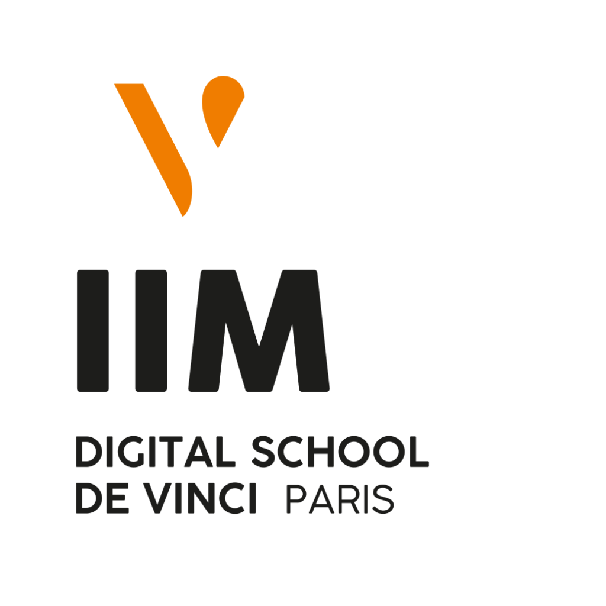

<h3 align="center">Hello there !</h3> 

My name is David but you can call me Creepail. :sunglasses:

---
<h3 align="center">Who am i ?</h3>

Im at college student, currently in my second year at [IIM](https://www.iim.fr) the best school ever !

Im also highly passionated about new tech and everything that is creative. I do art in my free time and im currently trying to learn ThreeJS for a school project

oh and im based around Paris ! but as you've been able to read so far, im fluent in both english and french. :sunglasses:

---

<h3 align="center">What i've learned so far</h3>

Im still quite new to the world of coding and have much to learn, so far i've learned html,css and a bit of php. My current passion being ThreeJS and it's secret :star:

---

<!--
**Creepail/Creepail** is a ✨ _special_ ✨ repository because its `README.md` (this file) appears on your GitHub profile.

Here are some ideas to get you started:

- 🔭 I’m currently working on ...
- 🌱 I’m currently learning ...
- 👯 I’m looking to collaborate on ...
- 🤔 I’m looking for help with ...
- 💬 Ask me about ...
- 📫 How to reach me: ...
- 😄 Pronouns: ...
- ⚡ Fun fact: ...
-->
